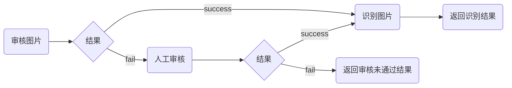
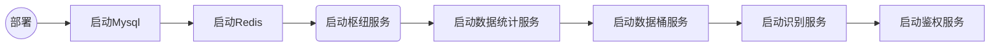

# 系统设计

## 架构


> 服务之间使用 TCP 进行通信，部署使用 docker-compose 来进行

## 主要服务

### 枢纽服务

- 标识: main
- 编号: 1
- 端口: 9000

实现服务管理，网关、配置中心

### 鉴权服务

- 标识: auth
- 编号: 2
- 端口: 9000

实现用户的功能

### 识别服务

- 标识: ai
- 编号: 3
- 端口: 9000

实现 AI 识别功能

#### 识别流程



### 数据桶服务

- 标识: odb
- 编号: 4
- 端口: 9000

实现文件上传功能

### 数据统计服务

- 标识: counter
- 编号: 5
- 端口: 9000

通过数据模型进行统计

### 备份服务

- 标识: backup
- 编号: 6
- 端口: 9000

用于备份/恢复数据库，对象存储

### MySQL 数据库

- 标识: mdb
- 编号: 7
- 端口: 3306

### Redis 数据库

- 标识: rdb
- 编号: 8
- 端口: 6379

## 部署流程



## 识别服务

### ### 数据模型

#### Photo

```ts
class Photo{
  id: number,// PK
  token: string, // 上传用户

  image: string, // 图片
  lowImage: string, // 小图
  longitude: number, // 经度
  latitude: number, // 纬度
  address: string, // 位置

  createAt: string,
  deleteAt: string
}
```

#### Animal

```ts
class Animal{
  id: number,
  code: string,

  name: string,
  type: string,
  info: string,
  tags: string,
  url: string,

  createAt: string,
  deleteAt: string
}
```

#### IdentifyResult

```ts
class IdentifyResult{
  id: number, // PK
  photoId: number,
  animalId: number,

  createAt: string,
  deleteAt: string
}
```

## 错误码设计

x x xx

- 第一段是服务编号
- 第二段是错误类型
  - 1(S): 系统错误
  - 2(B): 业务错误
  - 3(P): 参数错误
  - 4(D): 基础依赖错误
- 第三段是具体原因
