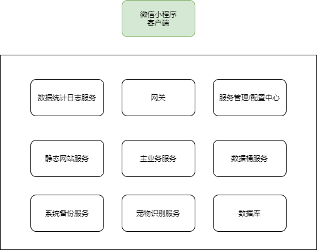

# 系统设计

## 架构



## 主要服务

### 主业务服务

实现该项目的所有功能，请看需求文档

### 识别服务

实现 AI 识别功能

### 数据桶服务

实现文件上传功能

### 网关服务

实现静态网站的存储，路由转发

### 数据统计服务

通过数据模型进行统计

### 服务管理/配置中心服务

通过配置中心注入环境变量可以安全的启动服务

### 备份服务

用于备份/恢复数据库，对象存储

## 主业务服务

- 代号：GGServer
- 编号：0
- 端口：8010

### 数据模型

#### User

```ts
class User{
  id: number, // PK
  username: string,
  password: string,
  email: string,

  openid: string,
  sessionKey: string,

  nick: string,
 	name: string,
  avatar: string,
  sex: string,

  phone: string,
  ip: string,

  createAt: string,
  deleteAt: string
}
```

## 识别服务

### 数据模型

#### Photo

```ts
class Photo{
  id: number,// PK
  token: string, // 上传用户

  image: string, // 图片
  lowImage: string, // 小图
  longitude: number, // 经度
  latitude: number, // 纬度
  address: string, // 位置

  createAt: string,
  deleteAt: string
}
```

#### Animal

```ts
class Animal{
  id: number,
  code: string,

  name: string,
  type: string,
  info: string,
  tags: string,
  url: string,

  createAt: string,
  deleteAt: string
}
```

#### IdentifyResult

```ts
class IdentifyResult{
  id: number, // PK
  photoId: number,
  animalId: number,

  createAt: string,
  deleteAt: string
}
```
